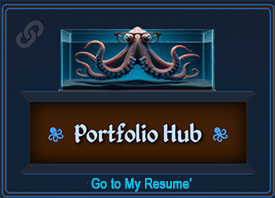

 
 <a href="https://mybabb.com" class="meImage">
 
 My home page
 </a>

  Click "Zale" the Octopus !
  <a href="https://resume-hub.mybabb.com">
  

  

 
 
   
   
 
   
    
 
 
   </a> 
   <h1 align="center">
    
</h1>

 
<!-- <h2 align="center" > Front-End Web Developer  </h2> -->

 
<!-- 

   

  

  
  

 -->

 

    
     
    
    
   

 

 
  
  

 

 

  

   
  
   
  

  

 

 

<h3 align="center">
    
</h3>

 

